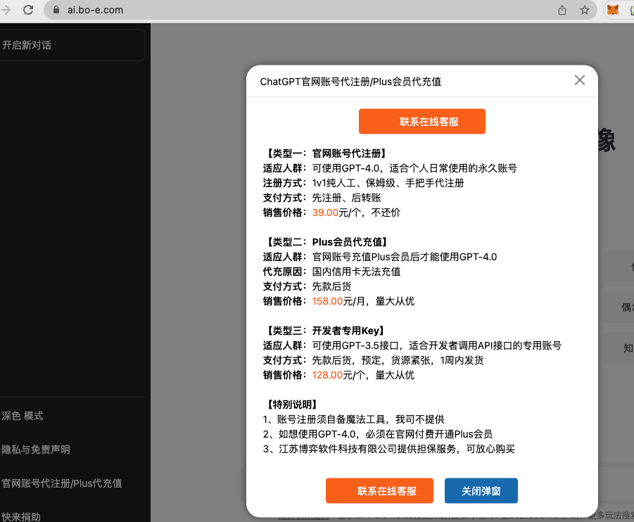

# 各类小程序

 微信、抖音、快手作为流量巨大的天然入口，当然是卖服务最好的场所

但是需要注意的是微信最近一直在下架原生chatgpt，所以要避免出现gpt相关词汇。

# 各类免翻网站

用chatgpt接口的国内免翻墙的网站，作为项目引流或者直接赚钱都是可以。

这些平台的搭建难度都很低，也都是用开源的项目搭建的，都是docker一键部署的。所以上手起来很快。
不过需要自备一台香港的服务器。

https://github.com/Chanzhaoyu/chatgpt-web
https://github.com/202252197/ChatGPT_JCM

以上两个项目都是使用量比较多的网站搭建方案。

