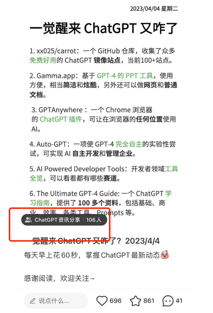

# 初级卖号
## 1. 通过电商平台，如淘宝、天猫、京东等
虽然"chatgpt"相关关键词已经被电商平台屏蔽，但是像"人工智能"相关的关键词总是屏蔽不完。

## 2. 建个卖号网站
这个方法比较简单，但是需要一点点的技术能力，需要自己搭建网站，然后通过网站卖号。

类似下图这样。

而这种虚拟资源贩卖网站的建设，开源的框架很多，都是docker一件部署的，几分钟就能建站。

## 3. 通过社交平台卖号
在个大的社交平台，如微博、抖音、快手个大相关博主作品下方评论区中发送引导性质评论。

通过这种方法也是能卖出去的，但是需要一定的技巧，需要自己去研究。

一般需要一个能发布自动评论的脚步，进行批量操作。量大一定会有找到你的。

# 中级卖号
通过在各个社交平台批量性质发布相关的内容，如"chatgpt"相关的内容，然后通过这些内容引导用户到自己的群里，从而达到卖号的目的。

下方一个小红书很多账号通过批量发布chatgpt相关的资讯，然后通过这些资讯引导用户到自己的群里进行卖号，特别是针对女性群体。

# 高级卖号
通过做社群，进入付费圈直接送ChatGPT账号