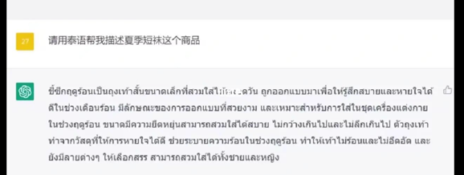
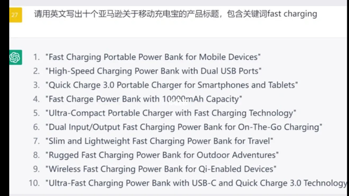
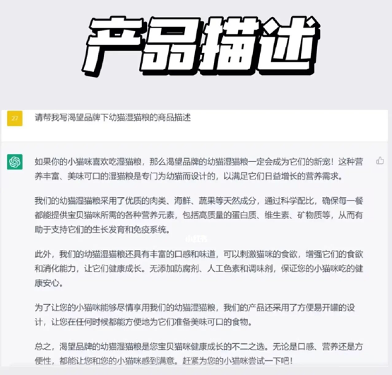
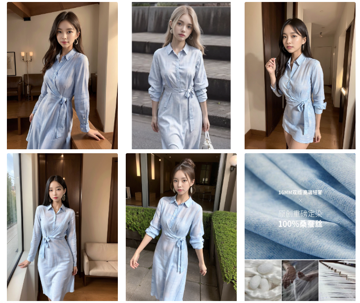
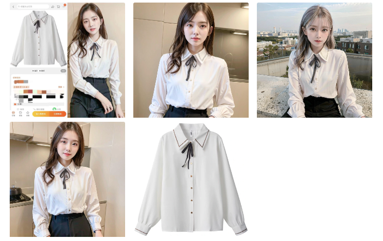
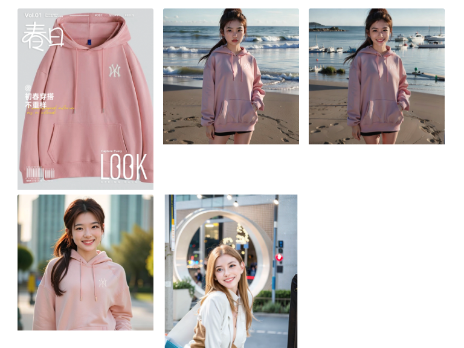

# 网店店主
chatgpt在跨境电商行业，简直属于核弹级别的效应呢。

👉下面我们从小语种翻译、标题优化、产品描述、撰写评价、品牌故事几个方面进行分析：

😘小语种翻译

跨境电商的主要障碍之一是难以与说不同语言的客户沟通。卖家可以借助ChatGPT提供实时翻译的功能，将产品描述、客户服务消息和其他重要信息翻译成目标市场的语言。确保客户能够了解业务提供的内容，并能够有效地进行沟通。

😘标题优化

作为跨境电商卖家，大家都知道标题对商品来说是非常重要的，好的标题可以吸引更多的用户点击和购买。通过Shopdora的关键词挖掘挑选几个最符合自己产品特点的热门关键词，再用这些关键词让ChatGPT写产品标题。

😘产品描述

卖家使用ChatGPT一键生成产品描述是非常简单的。在描述中加入包上含产品特性的关键词，例如品牌、型号、颜色等等以及其他符合自身产品特性的关键词，让ChatGPT生成产品描述。

😘撰写评价

好的评价可以让客户更有信心地购买自己的产品。只需要输入产品特点、使用体验等信息，ChatGPT会生成一些评价可供选择，也可以根据自己的需求进行微调。

😘品牌故事

品牌故事可以让客户了解卖家在售商品的品牌、理念和价值观，从而更好地认识我们的产品。我们只需要向ChatGPT提供一些关键信息，例如品牌的历史、市场数据、使命等等，还可以规定字数范围，就可以快速生成一则品牌故事。

🙌总体而言，ChatGPT可以成为跨境卖家运营过程中的宝贵工具，帮助卖家克服语言障碍、提高卖家运营效率。

# gpt相关直接让店主砍掉模特费用

是的，以下三个模特图，都是ai生成的。

这是一个很好的案例，可以让店主砍掉模特费用，直接用ai生成模特图，然后再用ai生成产品描述，这样就可以大大降低店主的成本，提高店主的利润。

当然，训练出逼真的ai模特图，也并不是每一个人都可以做到的，会学习的店主或者初创想做电商的新朋友，可以参考以下几个方面节约成本：

1，学习合适的模特图生成器

2，学习gpt生成产品描述，文案信息

