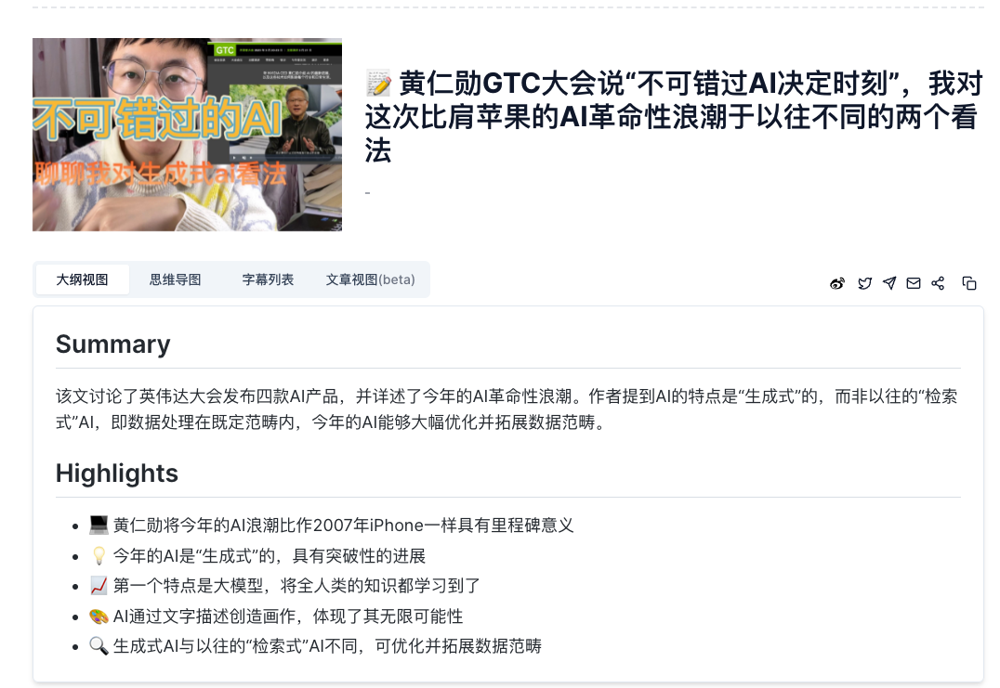
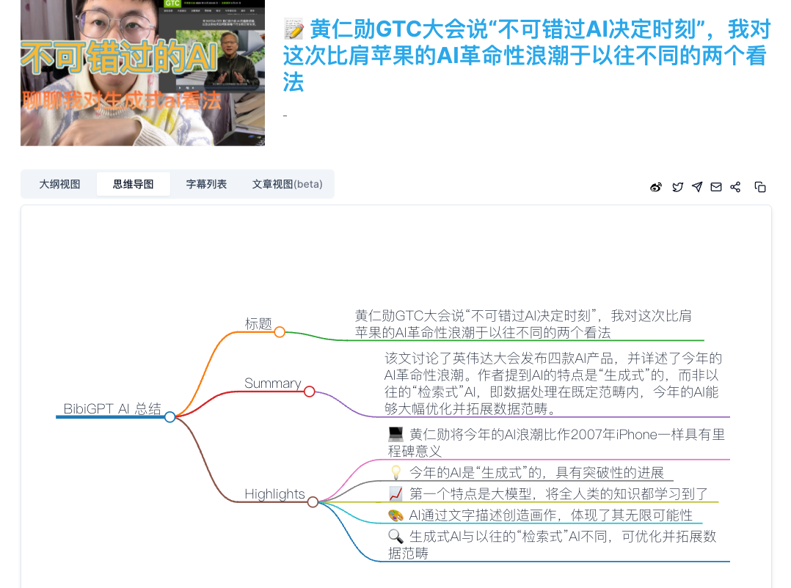
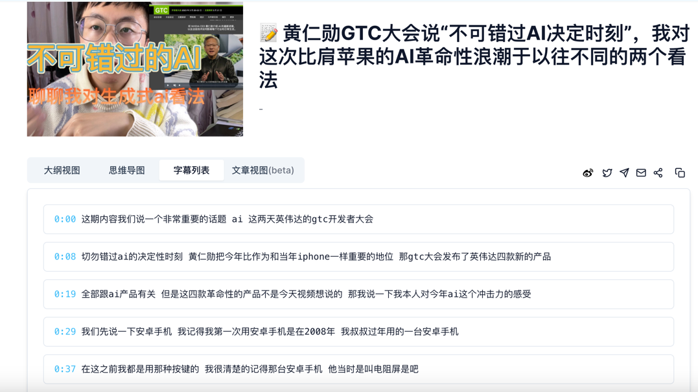
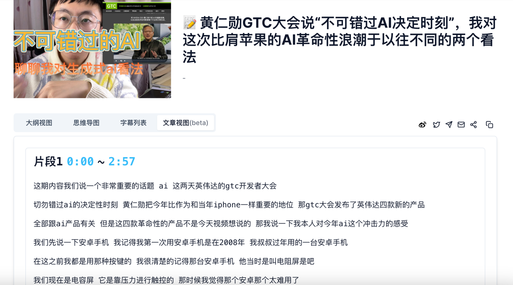
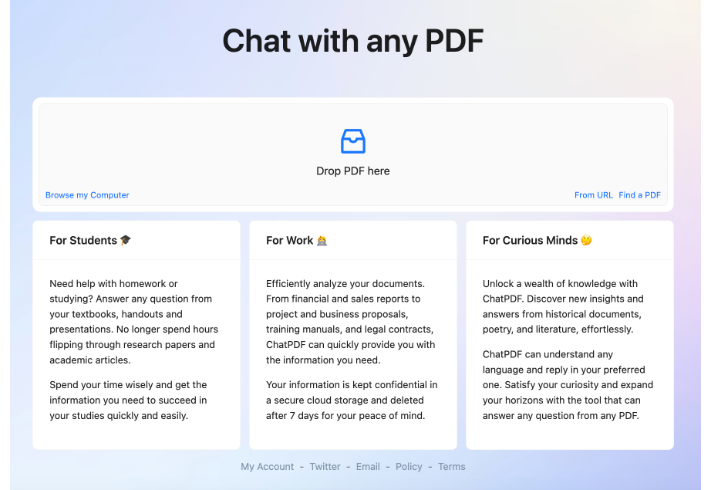
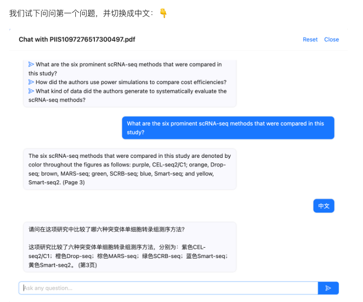

# 基于chatgpt为核心创建的优秀应用案例
本栏目展示都是完全开源项目，大家根据需求，自我搭建类似站点，或给自己产生idea.

首先，很感谢这些开源的作者～～～
    
- [BibiGPT](#BibiGPT)
- [Chat-pdf](#Chat-pdf)

## BibiGPT
一款帮你快速看音视频内容一键总结的应用。

只需要输入自己的想看的视频，立马帮你总结主要内容，思维导图，字幕列表，视频稿件。

对于知识输出类别的视频及其好用，观众一目了然视屏主要讲了什么。大大提高了观众的学习效率。

小屋觉得此类的创作，将会有很大应用场景。

项目地址：https://github.com/JimmyLv/BibiGPT

## Chat-pdf
一款基于chatgpt的pdf生成，可以帮你快速检索总结大量的pdf文档，实现在pdf文档的问答。

现在，甩一个PDF过去，它能自己读，你只负责提问就行。

一篇满是专业词汇的论文，它三言两语就能解释清楚，还都是中文大白话。

项目地址：https://github.com/mayooear/gpt4-pdf-chatbot-langchain

